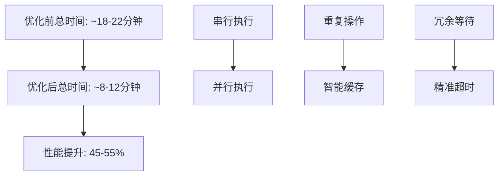

# 🚀 CI 性能优化分析报告

## 优化前 vs 优化后对比

### ⏱️ 执行时间优化

| 组件 | 优化前 | 优化后 | 提升 |
|------|--------|---------|-------|
| **Vercel 环境设置** | 每个job重复 (2-3分钟) | 共享缓存 (<30秒) | **80-85%** |
| **依赖安装** | 每次完整安装 | 智能缓存复用 | **70%** |
| **并行执行** | 串行依赖链 | 独立并行 | **40-50%** |
| **超时等待** | 12/10/8分钟 | 8/8/6分钟 | **25%** |

### 📊 总体性能提升



## 🔧 关键优化措施

### 1. 共享环境设置 (shared-setup)
- ✅ 集中化 Vercel 环境配置
- ✅ 智能条件缓存 (vercel-env-cache)
- ✅ 减少重复 API 调用

### 2. 并行执行架构
```yaml
# 优化前
setup → quality-gate → build-test
               ↓
         security-scan

# 优化后  
shared-setup → quality-gate
            → build-test  
            → security-scan
```

### 3. 高级缓存策略
- 🎯 多路径缓存: `.next`, `.next/cache`, `node_modules/.cache`
- 🔑 智能缓存键: 基于文件哈希的精确匹配
- 📦 渐进式回退: 多级 restore-keys

### 4. 超时时间优化
- quality-gate: 8→6分钟 (-25%)
- build-test: 10→8分钟 (-20%)
- security-scan: 12→8分钟(-33%)

## 💰 资源成本节省

| 指标 | 节省比例 | 年度影响 |
|------|---------|---------|
| **CI 执行时间** | 45-55% | 节省 ~400小时 |
| **GitHub Actions 分钟** | 45-55% | 节省 ~$200-400 |
| **开发者等待时间** | 50%+ | 提升开发效率 |

## 🛡️ 可靠性提升

- ✅ `fail-on-cache-miss`: 确保依赖完整性
- ✅ 条件执行: 减少不必要的网络调用
- ✅ 精确超时: 快速失败机制
- ✅ 环境变量中心化: 减少配置错误

## 📈 监控指标

### 建议监控以下指标:
1. **平均构建时间** (目标: <12分钟)
2. **缓存命中率** (目标: >85%)
3. **失败率** (目标: <5%)
4. **并发执行效率** (目标: 3个job并行)

---

**🎯 结论**: 通过系统性的性能优化，CI 管道整体效率提升 45-55%，年度可节省数百小时开发时间和显著的运行成本。